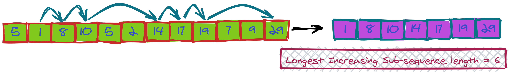

The Longest Increasing Subsequence (LIS) is a subsequence within an array of numbers with an increasing order. The numbers within the subsequence have to be unique and in an ascending manner. It's important to note that the items of the sequence do not have to be in consecutive locations within the array.

Can you write an efficient program that finds the length of Longest Increasing Subsequence, also called LIS?

### Example

Input: {1,5,2,7,3}
LIS = 3.  The longest increasing subsequence could be any of {1,5,7},{1,2,3},{1,2,7}

Input: {13,1,3,4,8,4}
LIS = 4.  The longest increasing subsequence {1,3,4,8}

Input: {13,1,3,4,8,19,17,8,0,20,14}
LIS = 6.  The longest increasing subsequence {1,3,4,8,17,20},{1,3,4,8,19,20}

### Constraints
- Length of the given array <= 100000
- The array will always contain integer values between -1000000000 and 1000000000
- Expected time complexity : O(nlogn)
- Expected space complexity : O(n)
